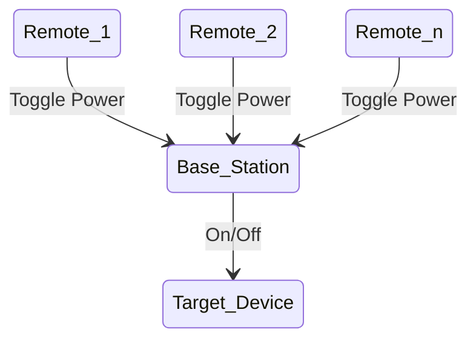

# Wireless Dust Collection System
A network of ESP nodes to control the dust collection system in my shop. Slapped together using minimal effort (Arduino) and leftover hardware from a previous life.

The basic network consists of 2 types of device, a Base Station and a Remote. The Base Station is wired up to the target device (In my case just a dust collector) that handles requests from any number of remotes to toggle power to the target device.

## Building and Flashing the "Firmware"
Two arduino projects barely qualify as firmware so I am not go too deep into details here either. The Arduino CLI doesnt work super well with the specific dev boards that I happen to have a lot of so I typically just use the Arduino IDE to build and flash the code. 

## Hardware
I am not gonna go into specifics here as I built this from a bunch of scrap parts and the circuit diagrams are trivial. 

### Base Station 
- ESP32 Dev Board
- A relay capable of handling 110V AC
- A button

### Remote
- ESP32 Dev Board
- A button

### Enclosures
For this inital version the remote is a fully 3d printable enclosure located under `hardware/enclosures/`. The base station utilizes the existing switch box on the harbor freight dust collector. All of the files I used are located in `hardware/enclosures/` but YMMV.